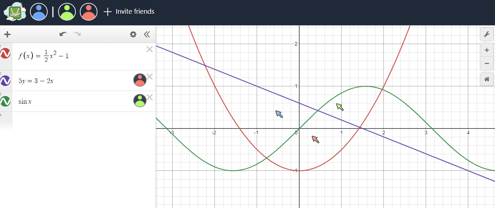

# Multiplayer Desmos

It's [Desmos](https://desmos.com/calculator/), but multiplayer.

## Usage

Go to `http://localhost:5173` and click "Invite others". An invite link will appear - copy and send this link to your friends. The equations and cursor positions will be synced across participant's browsers.

## Features

The main priorities of Multiplayer Desmos are **ease-of-use** and a **familiar user interface**. Speed is important, too - but it's not like it's written in Rust.

## Engineering

I used the Desmos API for the graph, [Y.js](https://github.com/yjs/yjs) as a peer-to-peer CRDT, and I hosted a signaling server myself.

The frontend is created with SvelteKit and Tailwind CSS.

## Installation (Windows)

1. Download the repo with git or download and unzip
2. With CMD line go into the main directory

### Front-end Dependencies (Svelte)
Install the dependencies:
  npm install
  npm install express body-parser cors

### List of Dependencies

Front-end (Svelte)
svelte
svelte/store
yjs
y-webrtc
Back-end (Node.js with Express)
express
body-parser
cors

## Running the Project
Start MD.bat and it should start running!
